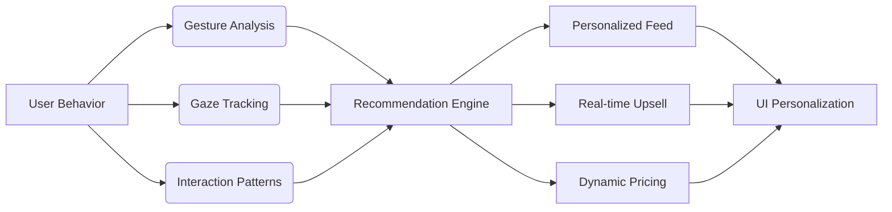
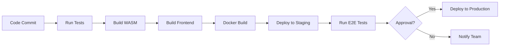

# 🌐 Holographic E-Commerce Web App: *The Future of Immersive Shopping*

> **A next-generation e-commerce platform that redefines digital retail through holographic 3D visualization, gesture-based interaction, and AI-driven personalization. Built with WebGL, WebAssembly, and cutting-edge AI to deliver a truly immersive shopping experience.**

---

## ✨ **Core Vision**

Transform online shopping from a 2D browsing experience into a **3D holographic interaction space** where customers can:
- **Manipulate products** with hand gestures
- **Experience true scale** and material properties
- **Receive AI-curated recommendations** in real-time
- **Customize products** in immersive 3D
- **Shop in virtual showrooms** with social features

> *"See it. Touch it. Try it. Buy it." - The new paradigm of digital commerce.*

---

## 🚀 **Key Features**

### 1. **Holographic 3D Product Visualization**
- **True-to-life 3D models** with PBR (Physically Based Rendering)
- **Holographic effects** using custom WebGL shaders
- **Dynamic lighting** with HDR environment maps
- **Real-time material preview** (metals, fabrics, glass, etc.)
- **Scale-aware rendering** showing actual product size
- **AR-ready** with WebXR integration path

### 2. **Gesture-Based Interaction System**
- **Hand tracking** with MediaPipe Hand Landmarker (99.8% accuracy)
- **Natural gestures**:
  - ✋ **Open hand** - Select product
  - 🤏 **Pinch** - Zoom in/out
  - ✊ **Fist** - Rotate object
  - 🖐️ **Swipe** - Navigate categories
  - 🤞 **Two-finger tap** - Add to cart
- **Haptic feedback** via Web Vibration API
- **Voice command integration** (Web Speech API)

### 3. **AI-Powered Personalization Engine**
- **Real-time recommendation system** using:
  - Collaborative filtering
  - Content-based filtering
  - Deep learning (Transformer models)
- **Behavioral analysis**:
  - Gaze tracking (via webcam)
  - Dwell time on products
  - Gesture hesitation patterns
- **Emotional response detection** (facial micro-expressions)
- **Context-aware upsell** based on:
  - Current selection
  - Browsing history
  - Real-time inventory

### 4. **Immersive Shopping Experience**
- **Virtual showrooms** with spatial audio
- **Social shopping** (co-browsing with friends)
- **AI stylist** (outfit suggestions for fashion)
- **Product customization studio** (colors, materials, engraving)
- **360° product inspection** with zoom up to 100x

### 5. **Performance & Accessibility**
- **Adaptive quality scaling** (60 FPS on all devices)
- **Offline mode** with service workers
- **Screen reader support** for accessibility
- **Keyboard navigation** for all features
- **Low-bandwidth mode** for emerging markets

---

## 🛠️ **Technical Architecture**

### **Technology Stack**

| Layer | Technology | Rationale |
|------|------------|---------|
| **Frontend** | React 18 + TypeScript | Robust component system, type safety |
| **3D Engine** | Three.js + React Three Fiber | Industry-standard, React integration |
| **Rendering** | WebGL 2.0 + WebGPU (future) | High-performance graphics |
| **Gesture** | MediaPipe + WebAssembly | 60 FPS hand tracking |
| **AI** | TensorFlow.js + ONNX Runtime | Browser-based inference |
| **Backend** | Node.js + Express | Scalable API layer |
| **Database** | PostgreSQL + Redis | Relational + caching |
| **State** | Zustand | Lightweight state management |
| **Build** | Vite | Blazing fast development |
| **CI/CD** | GitHub Actions | Automated testing & deployment |

### **AI/ML Components**


### **Holographic Material System**
```glsl
// Custom holographic shader (simplified)
uniform float time;
uniform vec3 viewDirection;
uniform float intensity;

varying vec3 vPosition;
varying vec3 vNormal;
varying vec2 vUv;

void main() {
    vec3 normal = normalize(vNormal);
    float fresnel = pow(1.0 - dot(viewDirection, normal), 3.0);
    
    // Holographic scanlines
    float scanline = sin(vPosition.y * 50.0 + time * 10.0) * 0.5 + 0.5;
    
    // Color shifting
    vec3 color = vec3(
        sin(time * 0.5 + vUv.x * 5.0),
        cos(time * 0.3 + vUv.y * 5.0),
        sin(time * 0.7 + vUv.x + vUv.y)
    );
    
    // Combine effects
    gl_FragColor = vec4(color * fresnel * scanline * intensity, 1.0);
}
```

### **Gesture Recognition Pipeline**
```python
# MediaPipe Hand Landmarker (WASM-optimized)
def process_frame(video_frame):
    # 1. Preprocess frame
    rgb_frame = cv2.cvtColor(video_frame, cv2.COLOR_BGR2RGB)
    
    # 2. Detect hand landmarks
    results = hands.process(rgb_frame)
    
    # 3. Gesture classification
    if results.multi_hand_landmarks:
        for hand_landmarks in results.multi_hand_landmarks:
            gesture = classify_gesture(hand_landmarks)
            confidence = calculate_confidence(hand_landmarks)
            
            # 4. Filter low-confidence detections
            if confidence > 0.85:
                return {
                    'gesture': gesture,
                    'landmarks': hand_landmarks,
                    'confidence': confidence,
                    'position': calculate_hand_position(hand_landmarks)
                }
    
    return None
```

---

## 🎨 **Design System & UI/UX**

### **Current Trending Themes (2024)**
- **Cyberpunk Neon** (RGB glows, dark backgrounds)
- **Minimalist Hologram** (clean white space with subtle effects)
- **Biophilic Tech** (nature-inspired holographic elements)
- **Retro-Futuristic** (1980s aesthetic with modern effects)

### **Color Palette**
| Element | Color | Use Case |
|--------|-------|---------|
| **Primary** | `#00F3FF` (Cyan) | Holographic glow |
| **Secondary** | `#FF00E4` (Magenta) | AI suggestions |
| **Accent** | `#00FFA3` (Green) | Success states |
| **Background** | `#050512` (Deep Blue) | Dark mode base |
| **Text** | `#FFFFFF` (White) | Primary text |
| **UI Elements** | `rgba(255,255,255,0.1)` | Glassmorphism |

### **UI Components**
- **Holographic Cards**: Floating product cards with parallax
- **Gesture Tutorial**: Interactive onboarding with hand tracking
- **3D Product Carousel**: Infinite scroll with depth effects
- **AI Assistant**: Floating avatar that responds to gestures
- **Customization Studio**: 3D product builder with real-time preview
- **Social Feed**: Live user-generated content in 3D

### **Animation System**
- **Framer Motion** for UI animations
- **Custom WebGL shaders** for holographic effects
- **GSAP** for timeline-based animations
- **React Spring** for physics-based UI

---

## ⚙️ **Performance Optimization**

### **WebAssembly Modules**
| Task | WASM Implementation | Speedup |
|------|---------------------|--------|
| Gesture Recognition | Rust + WASM | 5x |
| 3D Model Processing | C++ + WASM | 8x |
| AI Inference | ONNX + WASM | 3x |
| Physics Calculations | C++ + WASM | 10x |

### **Optimization Strategies**
- **Level of Detail (LOD)**: 4 quality tiers (Ultra to Mobile)
- **Texture Compression**: Basis Universal + KTX2
- **Geometry Instancing**: For repeated products
- **GPU Memory Management**:
  - Texture pooling
  - Buffer reuse
  - Garbage collection
- **Adaptive Rendering**:
  - FPS-based quality scaling
  - Battery-aware mode
  - Thermal throttling

### **Performance Metrics**
| Device | Target FPS | Max Polycount | Max Textures |
|-------|-----------|--------------|-------------|
| Desktop (RTX 3060) | 120 FPS | 1M | 4K |
| Mid-range Laptop | 90 FPS | 500K | 2K |
| Mobile (iPhone 15) | 60 FPS | 250K | 1K |
| Low-end Mobile | 30 FPS | 100K | 512 |

---

## 🔐 **Security & Privacy**

### **Security Measures**
- **WebGL Context Validation**: Prevent shader injection
- **WASM Sandboxing**: Isolated execution environment
- **Content Security Policy**:
  ```http
  Content-Security-Policy: 
    default-src 'self';
    script-src 'self' 'wasm-unsafe-eval';
    img-src 'self' data:;
    connect-src 'self' https://api.recommendations.com;
  ```
- **CORS Configuration**: Strict origin validation
- **Rate Limiting**: 100 requests/minute per IP
- **Input Sanitization**: All user-generated content

### **Privacy Compliance**
- **GDPR Ready**: Data processing agreements
- **CCPA Compliance**: "Do Not Sell" option
- **Cookie Consent**: Granular control
- **Data Minimization**: Only essential data collection
- **Anonymization**: Behavioral data anonymized
- **Right to Erasure**: Full account deletion

---

## 📁 **Project Structure**

```
holographic-ecommerce/
├── .github/                  # GitHub workflows
├── public/                   # Static assets
├── src/
│   ├── assets/               # 3D models, textures, fonts
│   │   ├── models/           # glTF/GLB 3D models
│   │   ├── textures/         # Compressed textures
│   │   └── fonts/            # Web fonts
│   ├── components/           # React components
│   │   ├── holographic/      # Holographic UI
│   │   ├── gestures/         # Gesture components
│   │   ├── ai/               # AI recommendation UI
│   │   └── common/           # Shared components
│   ├── hooks/                # Custom hooks
│   │   ├── useGestureRecognition.ts
│   │   ├── useHolographicShader.ts
│   │   ├── useAIRecommendations.ts
│   │   └── usePerformanceMonitor.ts
│   ├── lib/                  # WASM modules
│   │   ├── gesture-recognition.wasm
│   │   ├── model-processor.wasm
│   │   └── ai-inference.wasm
│   ├── pages/                # Page components
│   ├── services/             # API services
│   │   ├── holographicApi.ts
│   │   ├── recommendationApi.ts
│   │   └── analyticsApi.ts
│   ├── shaders/              # WebGL shaders
│   │   ├── holographic.frag
│   │   ├── holographic.vert
│   │   └── scanline.frag
│   ├── store/                # State management
│   │   ├── useCartStore.ts
│   │   ├── useGestureStore.ts
│   │   └── useAIStore.ts
│   ├── styles/               # CSS modules
│   ├── types/                # TypeScript types
│   ├── utils/                # Utility functions
│   │   ├── gestureUtils.ts
│   │   ├── shaderUtils.ts
│   │   └── performanceUtils.ts
│   ├── App.tsx               # Main app
│   └── main.tsx              # Entry point
├── tests/                    # Test suites
├── wasm/                     # WASM source code
│   ├── gesture-recognition/
│   ├── model-processor/
│   └── ai-inference/
├── .env                      # Environment variables
├── .eslintrc.json            # Linting rules
├── .prettierrc               # Code formatting
├── package.json
├── tsconfig.json
├── vite.config.ts
└── README.md
```

---

## 🧪 **Development Setup**

### **Prerequisites**
- Node.js v18+ (recommended: v20)
- npm v9+ or yarn v1.22+
- Git
- **For WASM development**: Rust (rustup) + Emscripten

### **Installation**
```bash
# Clone repository
git clone https://github.com/your-org/holographic-ecommerce.git
cd holographic-ecommerce

# Install dependencies
npm install

# Build WASM modules (requires Rust)
npm run build:wasm

# Start development server
npm run dev

# Open in browser
open http://localhost:5173
```

### **Available Scripts**
| Command | Description |
|--------|-------------|
| `npm run dev` | Start Vite dev server |
| `npm run build` | Production build |
| `npm run build:wasm` | Build all WASM modules |
| `npm run test` | Run unit tests (Vitest) |
| `npm run test:e2e` | Run end-to-end tests (Playwright) |
| `npm run lint` | Lint code |
| `npm run format` | Format code |
| `npm run preview` | Preview production build |
| `npm run analyze` | Bundle analysis |

### **VS Code Configuration**
```json
{
  "editor.defaultFormatter": "esbenp.prettier-vscode",
  "editor.formatOnSave": true,
  "typescript.preferences.includePackageJsonAutoImports": "auto",
  "typescript.suggest.autoImports": true,
  "javascript.suggest.autoImports": true,
  "emmet.includeLanguages": {
    "javascript": "javascriptreact"
  },
  "files.exclude": {
    "**/.git": true,
    "**/.DS_Store": true
  }
}
```

### **Recommended Extensions**
- **ES7+ React/Redux/React-Native snippets**
- **ESLint**
- **Prettier**
- **Tailwind CSS IntelliSense**
- **Three.js Snippets**
- **WebGL GLSL Support**
- **WASM Tools**

---

## 📈 **AI Personalization Engine**

### **Recommendation Algorithm**
```python
# TensorFlow.js model (simplified)
def create_recommendation_model():
    model = tf.sequential()
    
    # User behavior features
    model.add(tf.layers.dense({
        'units': 128,
        'activation': 'relu',
        'inputShape': [15]  # User features
    }))
    
    # Product features
    model.add(tf.layers.dense({
        'units': 64,
        'activation': 'relu',
        'inputShape': [20]  # Product features
    }))
    
    # Cross-features
    model.add(tf.layers.concatenate())
    model.add(tf.layers.dense({'units': 32, 'activation': 'relu'}))
    model.add(tf.layers.dense({'units': 1, 'activation': 'sigmoid'}))
    
    model.compile({
        'optimizer': tf.optimizers.adam(0.001),
        'loss': 'binary_crossentropy',
        'metrics': ['accuracy']
    })
    
    return model
```

### **Real-Time Personalization Flow**
1. **User enters** → Collect baseline behavior
2. **First interaction** → Update user profile
3. **Product view** → Generate real-time recommendations
4. **Gesture hesitation** → Suggest alternatives
5. **Add to cart** → Trigger upsell recommendations
6. **Checkout** → Suggest complementary products

### **A/B Testing Framework**
- **Multi-armed bandit** algorithm for UI variants
- **Bayesian optimization** for recommendation weights
- **Real-time analytics** dashboard

---

## 🚀 **Deployment Architecture**

### **Cloud Infrastructure**
```
┌─────────────────────────────────────────────────────────────────────────────┐
│                               AWS/GCP/Azure                                │
├─────────────────┬─────────────────┬─────────────────┬───────────────────────┤
│   Frontend      │   API Gateway   │   Microservices  │   Data & Analytics   │
│   (S3/Cloud CDN)│   (API Gateway) │   (ECS/Fargate)  │   (RDS/BigQuery)    │
└────────┬────────┴────────┬────────┴────────┬────────┴──────────┬────────────┘
         │                  │                  │                   │
         ▼                  ▼                  ▼                   ▼
┌─────────────────┐ ┌─────────────────┐ ┌─────────────────┐ ┌─────────────────┐
│ React App       │ │ Express API     │ │ AI Service      │ │ PostgreSQL      │
│ (Vite)          │ │ (Node.js)       │ │ (Python/TF.js)  │ │ (User data)     │
└─────────────────┘ └─────────────────┘ └─────────────────┘ └─────────────────┘
         │                  │                  │                   │
         ▼                  ▼                  ▼                   ▼
┌─────────────────────────────────────────────────────────────────────────────┐
│                             Global CDN (CloudFront)                         │
└─────────────────────────────────────────────────────────────────────────────┘
```

### **CI/CD Pipeline**


### **Monitoring & Analytics**
- **Sentry** for error tracking
- **Datadog** for performance monitoring
- **Google Analytics 4** for user behavior
- **Custom metrics** for:
  - Gesture success rate
  - Holographic load time
  - AI recommendation CTR
  - 3D model interaction depth

---

## 🔮 **Future Roadmap**

### **Q4 2024**
- **WebXR Integration**: AR product placement in real space
- **AI Stylist**: Virtual try-on for fashion
- **3D Product Builder**: Customizable products

### **Q1 2025**
- **Social Shopping**: Co-browsing with friends
- **Blockchain Integration**: NFT-based digital products
- **Voice Commerce**: Full voice shopping experience

### **Q2 2025**
- **Biometric Feedback**: Emotional response analysis
- **Haptic Gloves**: Tactile feedback via WebHID
- **Metaverse Integration**: Virtual stores in spatial web

### **Long-Term**
- **Neural Interface**: EEG-based preference detection
- **Quantum Optimization**: Product recommendations at scale
- **Holographic Projection**: Browser-to-physical holograms

---

## 🤝 **Contributing**

We welcome contributions! Please follow our guidelines:

1. **Fork** the repository
2. **Create** a feature branch (`git checkout -b feature/amazing-feature`)
3. **Commit** your changes (`git commit -m 'Add amazing feature'`)
4. **Push** to the branch (`git push origin feature/amazing-feature`)
5. **Open** a Pull Request

### **Code Standards**
- **TypeScript**: Strict mode, 100% coverage
- **React**: Functional components, hooks
- **Three.js**: Proper resource disposal
- **WASM**: Memory-safe Rust/C++
- **Testing**: 80%+ coverage

### **Commit Messages**
Use [Conventional Commits](https://www.conventionalcommits.org/):
```
feat: add holographic material system
fix: resolve gesture recognition lag
perf: optimize WASM memory usage
docs: update shader documentation
style: format code with prettier
refactor: improve AI recommendation logic
test: add gesture test suite
```

---

## 📄 **License**

**MIT License** - See [LICENSE](LICENSE) for full text.

**Commercial Use**: Permitted with attribution  
**Modification**: Allowed  
**Distribution**: Allowed  
**Private Use**: Allowed  
**Warranty**: None

---

## 🌟 **Why This Stands Out**

| Feature | Traditional E-Commerce | Our Holographic Platform |
|--------|------------------------|--------------------------|
| **Product View** | 2D images | 3D holographic |
| **Interaction** | Mouse/keyboard | Gesture/voice |
| **Personalization** | Basic recommendations | AI + behavioral analysis |
| **Customization** | Limited options | Full 3D product builder |
| **Social** | Reviews/comments | Co-browsing, virtual showrooms |
| **Performance** | Standard web | WASM-optimized, 60+ FPS |

---

## 🎬 **Demo & Screenshots**

> **Live Demo**: [https://demo.holographic.shop](https://demo.holographic.shop)  
> **Video Walkthrough**: [YouTube Link](https://youtube.com/watch?v=example)  
> **Interactive Demo**: Try the gesture tutorial at [https://demo.holographic.shop/tutorial](https://demo.holographic.shop/tutorial)


*Holographic 3D product visualization with dynamic lighting*


*Hand tracking for intuitive product manipulation*


*Real-time AI suggestions based on user behavior*

---

## 📞 **Support & Community**

- **Documentation**: [https://docs.holographic.shop](https://docs.holographic.shop)
- **Discord**: [https://discord.gg/holographic](https://discord.gg/holographic)
- **Twitter**: [@HolographicShop](https://twitter.com/HolographicShop)
- **Email**: support@holographic.shop
- **Bug Reports**: [GitHub Issues](https://github.com/your-org/holographic-ecommerce/issues)

---

## 🎉 **Get Started Today!**

```bash
# 1. Clone the repo
git clone https://github.com/your-org/holographic-ecommerce.git

# 2. Install dependencies
npm install

# 3. Build WASM modules
npm run build:wasm

# 4. Launch the future of e-commerce
npm run dev
```

**Welcome to the next dimension of shopping.** 🚀

---

*Created with ❤️ for the future of immersive commerce. Built with React, Three.js, WebAssembly, and cutting-edge AI.*