# Component Interaction Diagrams

## System Overview

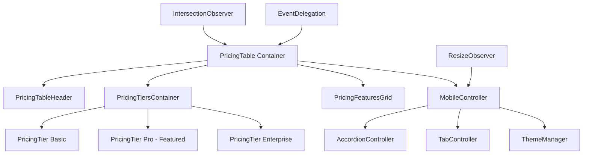

## Data Flow Architecture

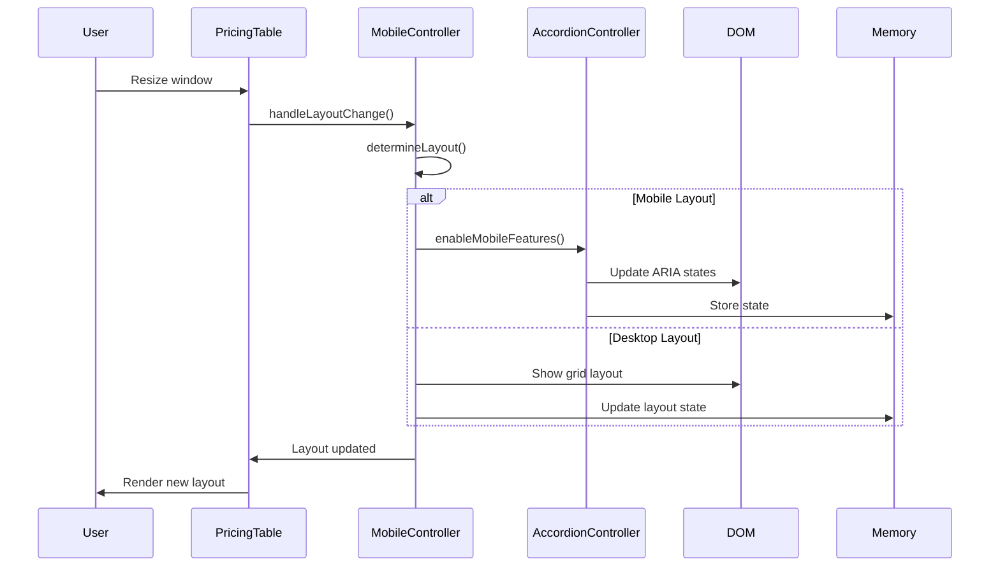

## Component Relationships

### 1. Container-Component Relationship
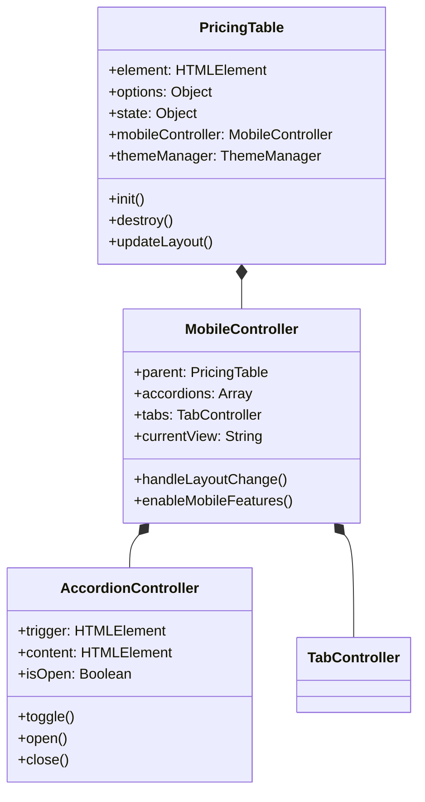

### 2. Event Flow Diagram
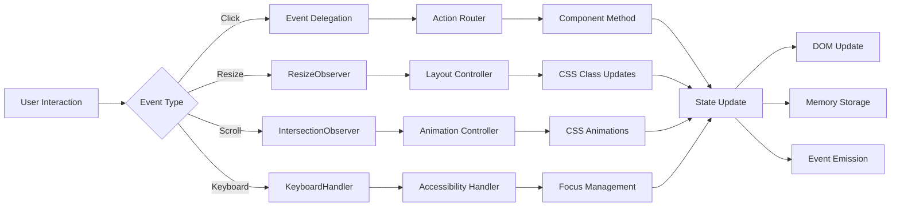

## State Management Flow

### 1. Component State Lifecycle
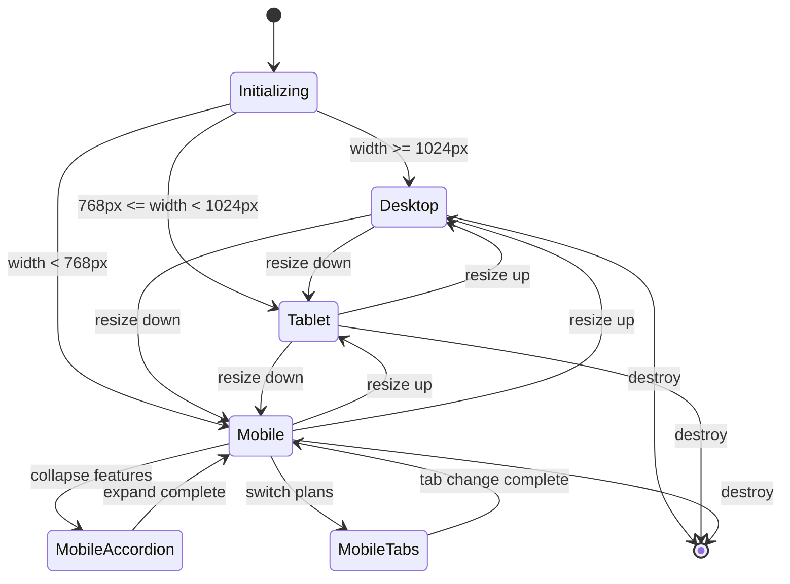

### 2. Data Dependencies
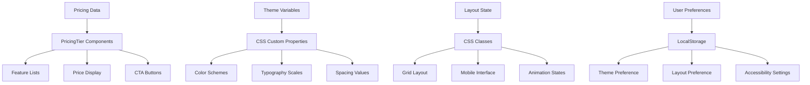

## Integration Patterns

### 1. Framework Integration Points
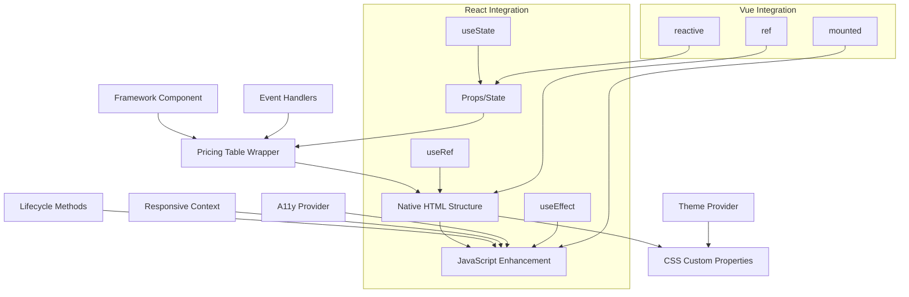

### 2. Event Communication Pattern
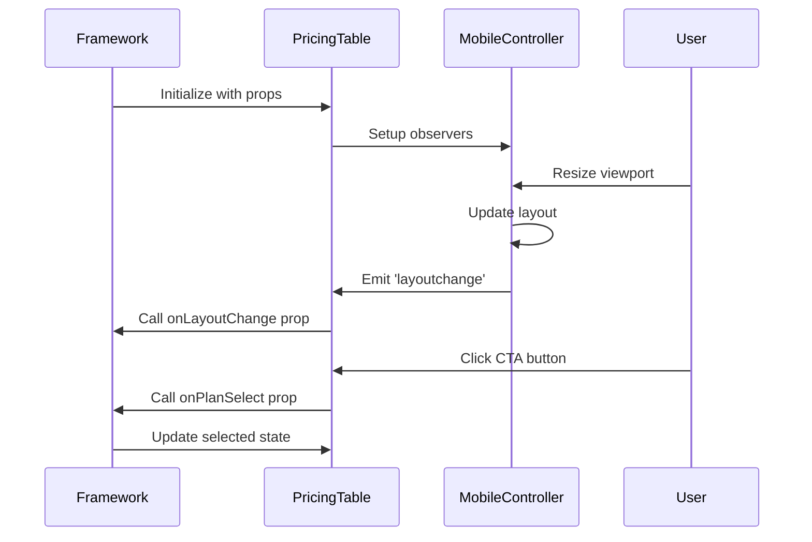

## Performance Optimization Patterns

### 1. Lazy Loading Strategy
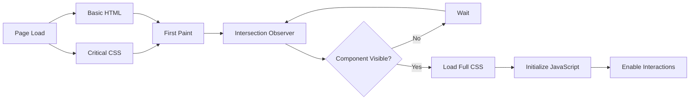

### 2. Memory Management Flow
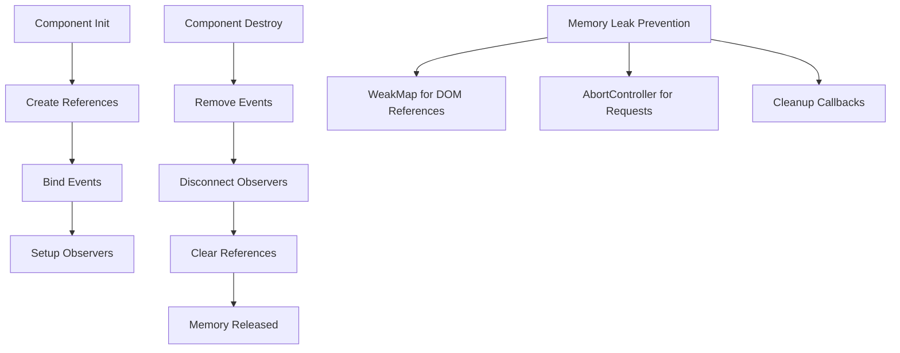

## Accessibility Interaction Model

### 1. Screen Reader Navigation
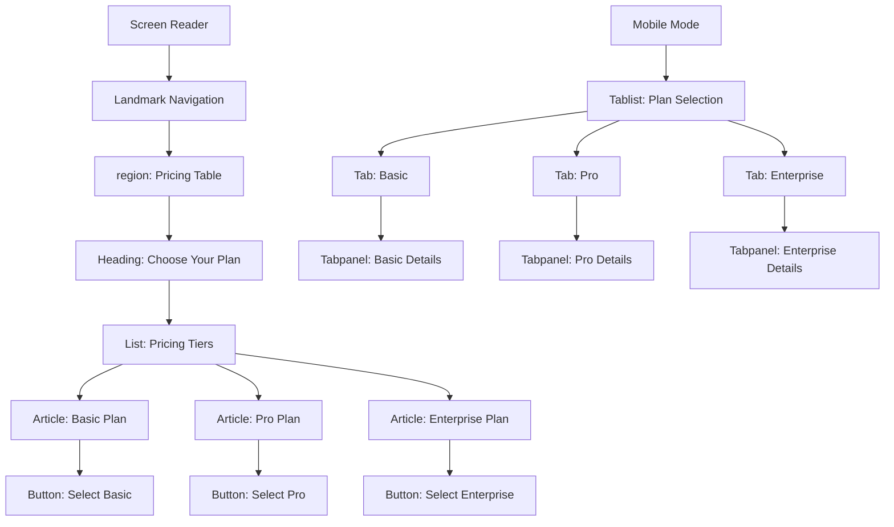

### 2. Keyboard Interaction Flow
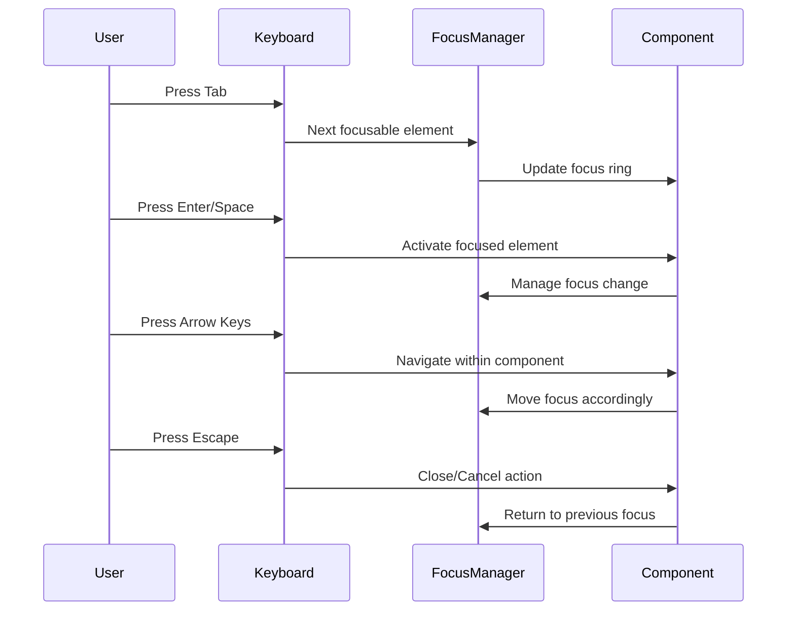

## Error Handling & Fallbacks

### 1. Progressive Enhancement Fallback
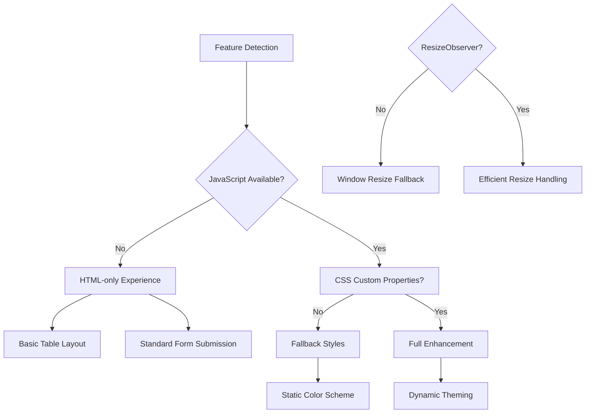

### 2. Error Recovery Pattern
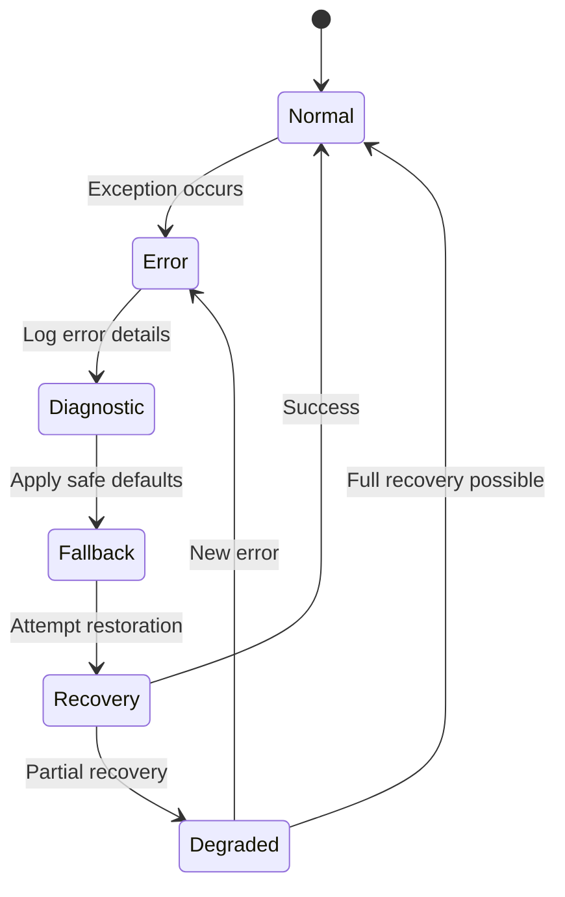

This comprehensive interaction architecture ensures smooth component communication, proper data flow, and robust error handling while maintaining accessibility and performance standards.