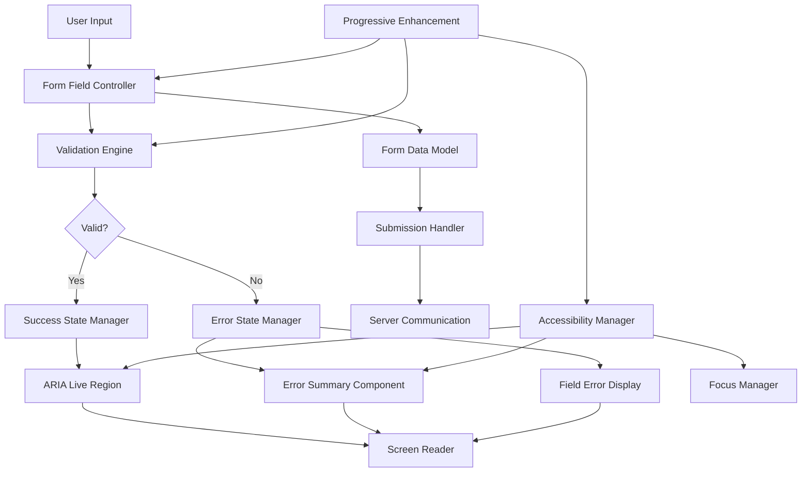
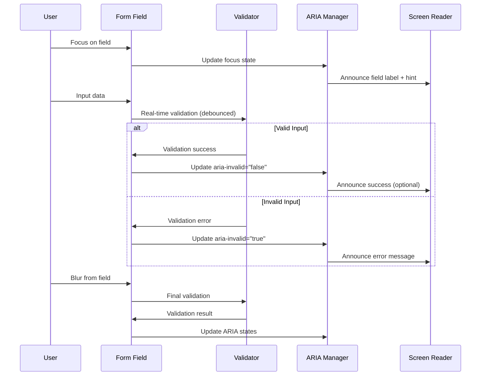
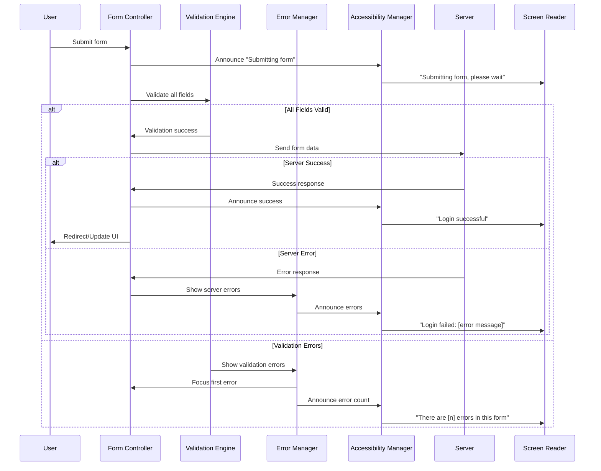
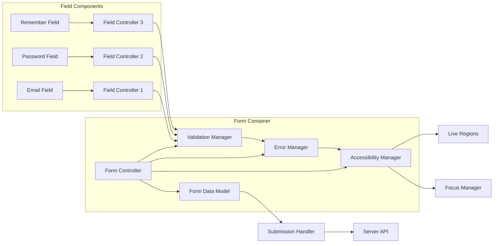
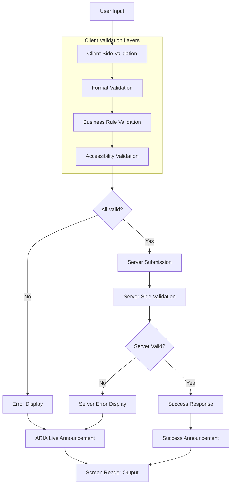
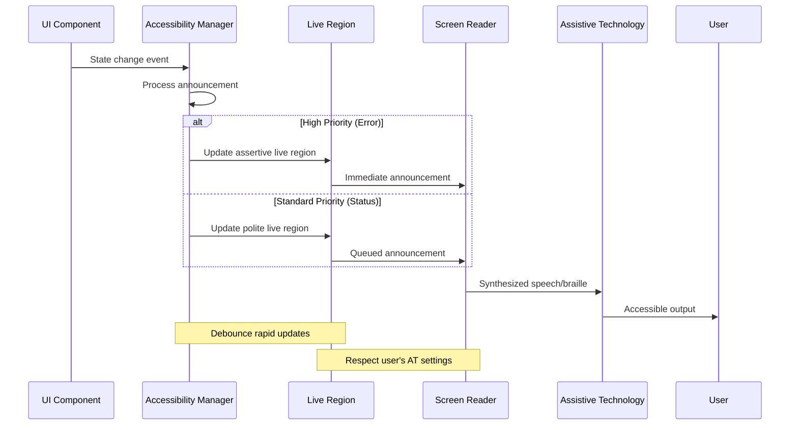
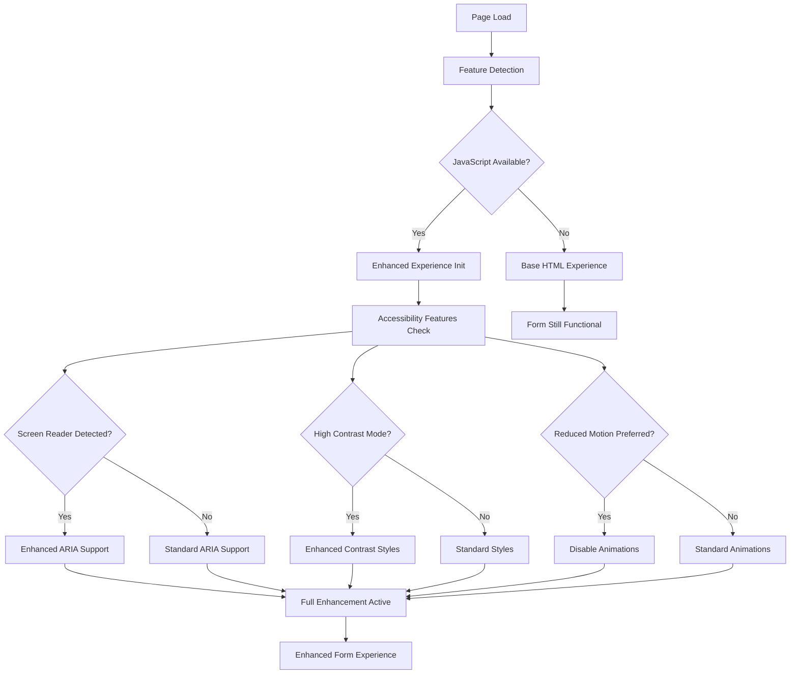
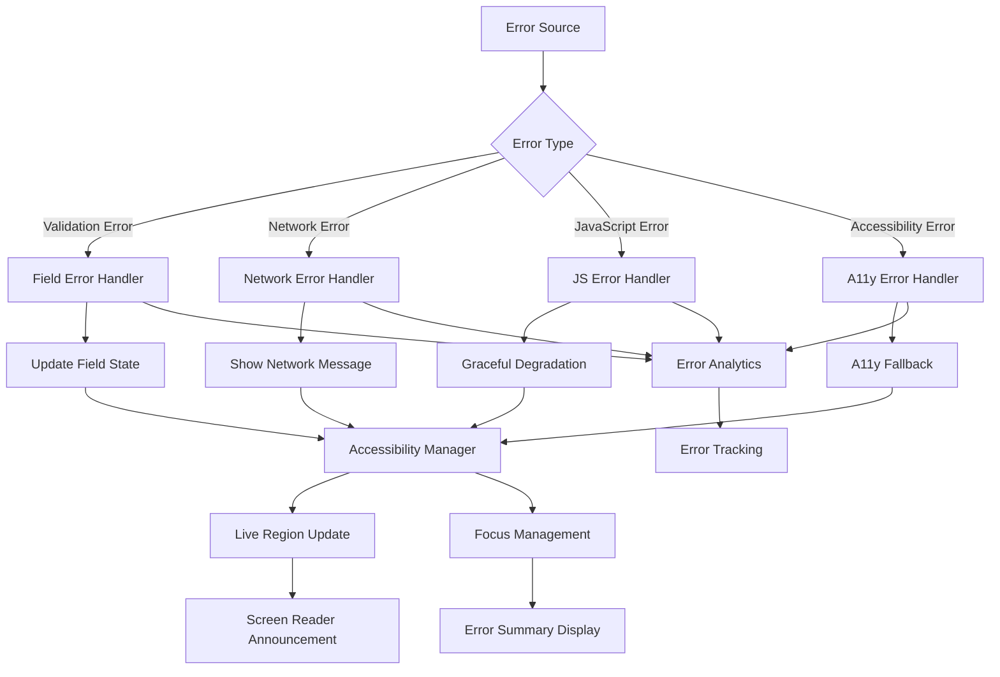

# Data Flow Diagrams - WCAG 2.1 Login Form System

## Overview

This document defines the data flow patterns and interactions within the accessible login form system, ensuring proper information flow for both user interactions and assistive technology communication.

## 1. High-Level Data Flow Architecture



## 2. User Interaction Flow

### 2.1 Form Field Interaction Pattern



### 2.2 Form Submission Flow



## 3. Component Communication Patterns

### 3.1 Inter-Component Data Flow



### 3.2 State Management Flow

```javascript
// State Flow Architecture
const StateManager = {
  // Central state store
  state: {
    formData: {
      email: '',
      password: '',
      remember: false
    },
    validation: {
      errors: {},
      touched: {},
      isValid: false
    },
    ui: {
      isSubmitting: false,
      showErrors: false,
      focusedField: null
    },
    accessibility: {
      announcements: [],
      liveRegionContent: '',
      errorSummaryVisible: false
    }
  },
  
  // State update methods
  updateField(fieldName, value) {
    this.state.formData[fieldName] = value;
    this.state.validation.touched[fieldName] = true;
    this.notifyComponents('FIELD_UPDATED', { fieldName, value });
  },
  
  updateValidation(fieldName, errors) {
    this.state.validation.errors[fieldName] = errors;
    this.state.validation.isValid = Object.keys(this.state.validation.errors)
      .every(key => this.state.validation.errors[key].length === 0);
    this.notifyComponents('VALIDATION_UPDATED', { fieldName, errors });
  },
  
  // Component notification system
  subscribers: new Map(),
  
  subscribe(component, callback) {
    if (!this.subscribers.has(component)) {
      this.subscribers.set(component, []);
    }
    this.subscribers.get(component).push(callback);
  },
  
  notifyComponents(action, payload) {
    this.subscribers.forEach(callbacks => {
      callbacks.forEach(callback => callback(action, payload));
    });
  }
};
```

## 4. Validation Data Flow

### 4.1 Multi-Layer Validation Pattern



### 4.2 Real-Time Validation Flow

```javascript
// Validation Flow Implementation
class ValidationFlow {
  constructor(formController) {
    this.form = formController;
    this.debounceMap = new Map();
    this.validationQueue = [];
  }
  
  async validateField(fieldName, value, trigger = 'input') {
    // Clear existing debounce for this field
    if (this.debounceMap.has(fieldName)) {
      clearTimeout(this.debounceMap.get(fieldName));
    }
    
    // Set up debounced validation
    const validationPromise = new Promise((resolve) => {
      const timeoutId = setTimeout(async () => {
        const result = await this.runFieldValidation(fieldName, value, trigger);
        resolve(result);
      }, trigger === 'input' ? 300 : 0); // Debounce input, immediate on blur
      
      this.debounceMap.set(fieldName, timeoutId);
    });
    
    const result = await validationPromise;
    this.handleValidationResult(fieldName, result, trigger);
    
    return result;
  }
  
  async runFieldValidation(fieldName, value, trigger) {
    const validators = this.getValidatorsForField(fieldName);
    const errors = [];
    
    // Run validators in sequence
    for (const validator of validators) {
      try {
        const result = await validator.validate(value, {
          trigger,
          formData: this.form.getData(),
          fieldName
        });
        
        if (!result.isValid) {
          errors.push(result.error);
          
          // Stop on first error for better UX
          if (trigger === 'blur' || result.stopOnError) {
            break;
          }
        }
      } catch (error) {
        console.error(`Validation error for ${fieldName}:`, error);
        errors.push('Validation failed. Please try again.');
      }
    }
    
    return {
      fieldName,
      isValid: errors.length === 0,
      errors,
      trigger
    };
  }
  
  handleValidationResult(fieldName, result, trigger) {
    // Update state
    StateManager.updateValidation(fieldName, result.errors);
    
    // Update UI
    const fieldController = this.form.getField(fieldName);
    fieldController.updateValidationState(result);
    
    // Handle accessibility announcements
    if (trigger === 'blur' && !result.isValid) {
      AccessibilityManager.announceFieldError(fieldName, result.errors[0]);
    } else if (trigger === 'input' && result.isValid && result.previouslyInvalid) {
      AccessibilityManager.announceFieldValid(fieldName);
    }
  }
}
```

## 5. Accessibility Data Flow

### 5.1 Screen Reader Communication Pattern



### 5.2 ARIA State Management Flow

```javascript
// ARIA State Management System
class AriaStateManager {
  constructor() {
    this.stateMap = new Map();
    this.observers = [];
  }
  
  updateAriaState(element, attributes) {
    const elementId = element.id || this.generateId(element);
    const currentState = this.stateMap.get(elementId) || {};
    
    // Merge new attributes with current state
    const newState = { ...currentState, ...attributes };
    this.stateMap.set(elementId, newState);
    
    // Apply attributes to DOM
    Object.entries(newState).forEach(([attr, value]) => {
      if (value === null || value === undefined) {
        element.removeAttribute(attr);
      } else {
        element.setAttribute(attr, value.toString());
      }
    });
    
    // Notify observers of state change
    this.notifyObservers(elementId, newState);
  }
  
  getAriaState(element) {
    const elementId = element.id || this.generateId(element);
    return this.stateMap.get(elementId) || {};
  }
  
  // Example usage patterns
  setFieldError(fieldElement, errorMessage) {
    this.updateAriaState(fieldElement, {
      'aria-invalid': 'true',
      'aria-describedby': `${fieldElement.id}-error ${fieldElement.getAttribute('aria-describedby') || ''}`.trim()
    });
    
    // Update error container
    const errorContainer = document.getElementById(`${fieldElement.id}-error`);
    if (errorContainer) {
      errorContainer.textContent = errorMessage;
      errorContainer.hidden = false;
    }
  }
  
  clearFieldError(fieldElement) {
    this.updateAriaState(fieldElement, {
      'aria-invalid': 'false'
    });
    
    // Remove error from aria-describedby
    const describedBy = fieldElement.getAttribute('aria-describedby') || '';
    const errorId = `${fieldElement.id}-error`;
    const newDescribedBy = describedBy
      .replace(errorId, '')
      .replace(/\s+/g, ' ')
      .trim();
    
    this.updateAriaState(fieldElement, {
      'aria-describedby': newDescribedBy || null
    });
    
    // Hide error container
    const errorContainer = document.getElementById(errorId);
    if (errorContainer) {
      errorContainer.hidden = true;
      errorContainer.textContent = '';
    }
  }
}
```

## 6. Progressive Enhancement Data Flow

### 6.1 Feature Detection and Enhancement



### 6.2 Progressive Enhancement Implementation

```javascript
// Progressive Enhancement Controller
class ProgressiveEnhancer {
  constructor() {
    this.capabilities = {};
    this.enhancements = [];
  }
  
  detectCapabilities() {
    this.capabilities = {
      javascript: true, // We're running JS
      intersectionObserver: 'IntersectionObserver' in window,
      customElements: 'customElements' in window,
      webComponents: 'customElements' in window && 'ShadowRoot' in window,
      serviceWorker: 'serviceWorker' in navigator,
      localStorage: this.testLocalStorage(),
      speechSynthesis: 'speechSynthesis' in window,
      screenReader: this.detectScreenReader(),
      highContrast: this.detectHighContrast(),
      reducedMotion: this.detectReducedMotion(),
      touchDevice: this.detectTouchDevice()
    };
    
    return this.capabilities;
  }
  
  applyEnhancements() {
    // Base enhancements (always applied)
    this.applyBaseEnhancements();
    
    // Conditional enhancements
    if (this.capabilities.intersectionObserver) {
      this.applyLazyLoading();
    }
    
    if (this.capabilities.localStorage) {
      this.applyFormPersistence();
    }
    
    if (this.capabilities.speechSynthesis && this.capabilities.screenReader) {
      this.applyAudioFeedback();
    }
    
    if (this.capabilities.touchDevice) {
      this.applyTouchEnhancements();
    }
    
    if (this.capabilities.reducedMotion) {
      this.disableAnimations();
    }
    
    if (this.capabilities.highContrast) {
      this.applyHighContrastEnhancements();
    }
  }
  
  applyBaseEnhancements() {
    // Real-time validation
    this.enableRealtimeValidation();
    
    // ARIA live regions
    this.initializeLiveRegions();
    
    // Focus management
    this.initializeFocusManagement();
    
    // Error summary
    this.initializeErrorSummary();
  }
  
  detectScreenReader() {
    // Multiple detection methods
    const indicators = [
      navigator.userAgent.includes('NVDA'),
      navigator.userAgent.includes('JAWS'),
      navigator.userAgent.includes('WindowEyes'),
      navigator.userAgent.includes('VoiceOver'),
      'speechSynthesis' in window && window.speechSynthesis.getVoices().length > 0,
      document.querySelector('[aria-live]') !== null
    ];
    
    return indicators.some(indicator => indicator);
  }
  
  detectHighContrast() {
    // Test for Windows High Contrast mode
    const testElement = document.createElement('div');
    testElement.style.cssText = 'border: 1px solid; border-color: red green blue; position: absolute; visibility: hidden;';
    document.body.appendChild(testElement);
    
    const computedStyle = window.getComputedStyle(testElement);
    const borderColors = [
      computedStyle.borderTopColor,
      computedStyle.borderRightColor,
      computedStyle.borderBottomColor
    ];
    
    document.body.removeChild(testElement);
    
    // In high contrast mode, all borders will be the same color
    const isHighContrast = borderColors.every(color => color === borderColors[0]);
    
    // Also check CSS media query
    const mediaQueryHighContrast = window.matchMedia('(prefers-contrast: high)').matches;
    
    return isHighContrast || mediaQueryHighContrast;
  }
  
  detectReducedMotion() {
    return window.matchMedia('(prefers-reduced-motion: reduce)').matches;
  }
  
  detectTouchDevice() {
    return 'ontouchstart' in window || navigator.maxTouchPoints > 0;
  }
  
  gracefulDegradation(error, enhancement) {
    console.warn(`Enhancement "${enhancement}" failed:`, error);
    
    // Log for analytics
    this.logEnhancementFailure(enhancement, error);
    
    // Ensure core functionality still works
    this.validateCoreFunctionality();
  }
  
  validateCoreFunctionality() {
    // Ensure form submission still works
    const form = document.querySelector('.login-form');
    if (form && !form.onsubmit) {
      form.addEventListener('submit', this.basicFormSubmissionHandler);
    }
    
    // Ensure basic validation messages show
    const errorContainers = document.querySelectorAll('.field-error');
    errorContainers.forEach(container => {
      if (!container.textContent && !container.hidden) {
        container.style.display = 'block';
      }
    });
  }
}
```

## 7. Error Handling Data Flow

### 7.1 Error Propagation Pattern



### 7.2 Comprehensive Error Handling

```javascript
// Centralized Error Management System
class ErrorManager {
  constructor() {
    this.errors = new Map();
    this.errorHistory = [];
    this.maxHistorySize = 50;
    this.accessibilityManager = new AccessibilityManager();
  }
  
  handleError(error, context = {}) {
    const errorId = this.generateErrorId();
    const errorDetails = {
      id: errorId,
      timestamp: new Date().toISOString(),
      type: error.type || 'unknown',
      message: error.message || 'An unknown error occurred',
      context,
      resolved: false
    };
    
    // Store error
    this.errors.set(errorId, errorDetails);
    this.addToHistory(errorDetails);
    
    // Route to appropriate handler
    switch (error.type) {
      case 'validation':
        return this.handleValidationError(error, context);
      case 'network':
        return this.handleNetworkError(error, context);
      case 'accessibility':
        return this.handleAccessibilityError(error, context);
      case 'javascript':
        return this.handleJavaScriptError(error, context);
      default:
        return this.handleGenericError(error, context);
    }
  }
  
  handleValidationError(error, context) {
    const { fieldName, fieldId } = context;
    
    // Update field state
    const field = document.getElementById(fieldId);
    if (field) {
      this.accessibilityManager.setFieldError(field, error.message);
    }
    
    // Announce to screen reader
    this.accessibilityManager.announceError(
      `Error in ${fieldName}: ${error.message}`,
      'polite'
    );
    
    // Track for analytics
    this.trackError('validation', error.message, context);
    
    return {
      handled: true,
      action: 'field_error_displayed'
    };
  }
  
  handleNetworkError(error, context) {
    // Determine if it's a recoverable error
    const isRecoverable = error.status !== 404 && error.status !== 403;
    
    let userMessage;
    if (error.status === 429) {
      userMessage = 'Too many attempts. Please wait a moment before trying again.';
    } else if (error.status >= 500) {
      userMessage = 'Server error. Please try again in a few moments.';
    } else if (error.status === 401) {
      userMessage = 'Authentication failed. Please check your credentials.';
    } else {
      userMessage = 'Connection error. Please check your internet connection and try again.';
    }
    
    // Show user-friendly message
    this.showNetworkErrorMessage(userMessage, isRecoverable);
    
    // Announce to screen reader
    this.accessibilityManager.announceError(userMessage, 'assertive');
    
    return {
      handled: true,
      recoverable: isRecoverable,
      action: 'network_error_displayed'
    };
  }
  
  handleAccessibilityError(error, context) {
    // Log accessibility issues but don't break functionality
    console.warn('Accessibility error:', error.message, context);
    
    // Try to provide fallback
    if (context.fallbackAction) {
      context.fallbackAction();
    }
    
    // Track for improvement
    this.trackError('accessibility', error.message, context);
    
    return {
      handled: true,
      action: 'accessibility_fallback_applied'
    };
  }
  
  showErrorSummary(errors) {
    const errorSummary = document.getElementById('error-summary');
    if (!errorSummary) return;
    
    // Build error summary HTML
    const errorList = errors.map(error => `
      <li class="error-item">
        <a href="#${error.fieldId}" class="error-link">
          ${error.message}
        </a>
      </li>
    `).join('');
    
    const errorCount = errors.length;
    const errorCountText = errorCount === 1 ? 'is 1 error' : `are ${errorCount} errors`;
    
    errorSummary.innerHTML = `
      <h2 id="error-summary-heading" class="error-summary-heading">
        <span class="error-icon" aria-hidden="true">⚠</span>
        There ${errorCountText} that need${errorCount === 1 ? 's' : ''} your attention
      </h2>
      
      <div class="error-summary-body">
        <p class="error-summary-description">
          Please review and correct the following:
        </p>
        
        <ul class="error-list" role="list">
          ${errorList}
        </ul>
      </div>
    `;
    
    // Show and focus error summary
    errorSummary.hidden = false;
    errorSummary.focus();
    
    // Announce error count
    this.accessibilityManager.announceError(
      `There ${errorCountText} in this form that need${errorCount === 1 ? 's' : ''} your attention`,
      'assertive'
    );
    
    // Set up error link navigation
    this.setupErrorLinkNavigation(errorSummary);
  }
  
  setupErrorLinkNavigation(errorSummary) {
    const errorLinks = errorSummary.querySelectorAll('.error-link');
    
    errorLinks.forEach(link => {
      link.addEventListener('click', (event) => {
        event.preventDefault();
        
        const targetId = link.getAttribute('href').substring(1);
        const targetField = document.getElementById(targetId);
        
        if (targetField) {
          targetField.focus();
          
          // Announce field label to provide context
          const label = document.querySelector(`label[for="${targetId}"]`);
          if (label) {
            this.accessibilityManager.announceError(
              `Focused on ${label.textContent.trim()}`,
              'polite'
            );
          }
        }
      });
    });
  }
}
```

This comprehensive data flow documentation provides a complete picture of how information moves through the accessible login form system, ensuring proper coordination between components while maintaining WCAG 2.1 AA compliance throughout all user interactions.